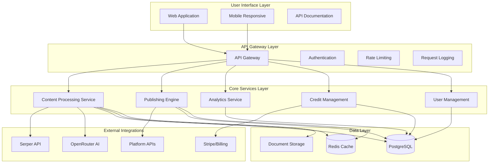

# System Overview

## Current State Assessment

**SEO Wizard Legacy Assets**:
- ✅ OpenRouter AI integration (proven at scale)
- ✅ Credit system foundation (requires enhancement)
- ✅ User authentication & dashboard (needs modernization)
- ✅ Content optimization algorithms (solid foundation)

**Evolution Requirements**:
- Migrate from expensive DataforSEO ($200-500/month) to Serper API ($50/month)
- Add document upload & processing pipeline
- Implement multi-platform publishing automation
- Enhance credit system for modern SaaS pricing
- Scale from hundreds to thousands of users

## Target Architecture Vision

